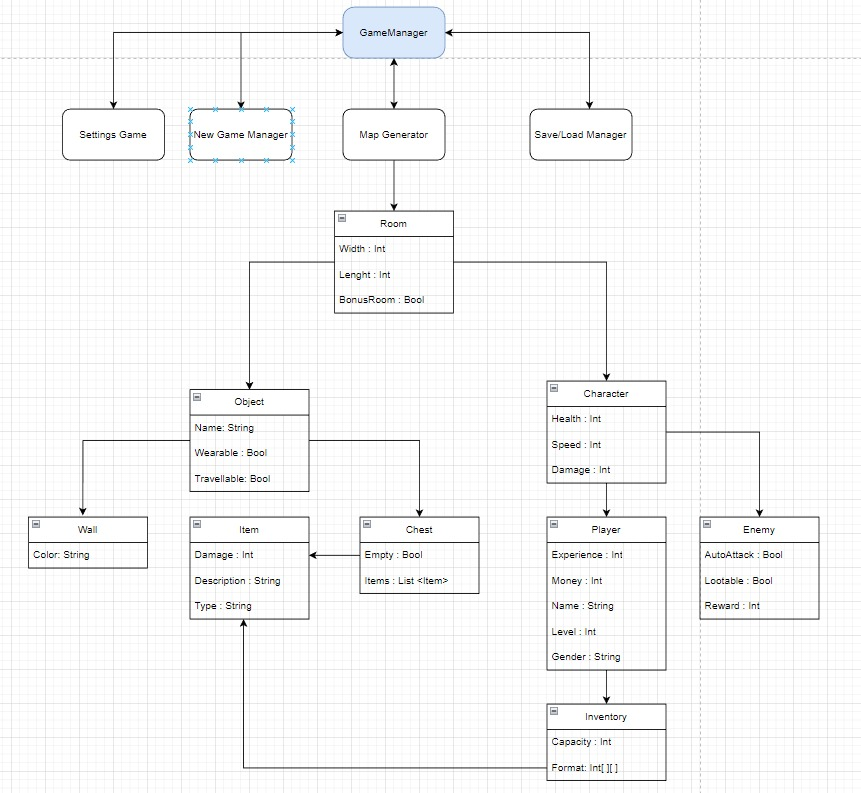

# Brother-s-revenge
Brother's Revenge is an epic roguelike dungeon crawler game that will test your courage, strategy, and determination. Embark on a perilous journey through procedurally generated maps, where every step is filled with suspense and surprise. Prepare to face hordes of enemies, discover valuable treasures, and uncover the secrets hidden within each dungeon.

Features
Procedurally Generated Maps: No two dungeons are alike. With each playthrough, experience a new and unique labyrinth, ensuring endless replayability.

Random Enemies and Items: Encounter a variety of foes and powerful items that can turn the tide of battle. Every encounter is a test of skill and resourcefulness.

Special Enemy Rooms: Beware of the special enemy rooms scattered throughout the dungeons. These challenging encounters will push your limits and reward you with great spoils upon victory.

Starting Room: Begin your adventure in the starting room, a safe haven where you can prepare yourself for the dangers that lie ahead. Take a moment to plan your strategy and gather your strength.

Treasure Room: Seek out the treasure room, a haven of valuable loot that could significantly enhance your chances of survival. But be wary, for it may be guarded by formidable adversaries.

Melee and Ranged Enemies: Prepare to face a diverse array of foes. Some enemies will charge at you relentlessly, while others will keep their distance, attacking from afar. Adapt your tactics to prevail against each type.

Dynamic Enemy AI: Witness intelligent enemy behavior as they react and adapt to your actions. Some enemies may flee from you if you prove too formidable, while others may chase you down relentlessly.

